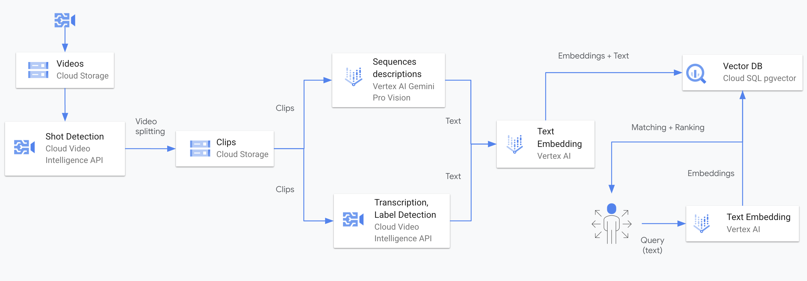

# Talk to your Videos

This repo includes a demonstration example for building a `Video Search app` with Generative AI. Components that will be used for this demo include:

 - [Gemini Pro Vision](https://cloud.google.com/vertex-ai/docs/generative-ai/multimodal/overview) to generate video description, title, labels, etc.
 - [Vertex AI Embeddings](https://cloud.google.com/vertex-ai/docs/generative-ai/embeddings/get-text-embeddings) to embed generated descriptions into vectors.
 - [Video Intelligence API](https://cloud.google.com/video-intelligence/docs) to detect shots / sequences, labels, transcription, etc.
 - [Google Cloud SQL](https://cloud.google.com/sql/docs/postgres) for Postgres as a vector database with [pgvector](https://github.com/pgvector/pgvector)
 - [Langchain](https://python.langchain.com/docs/get_started/introduction) as an orchestrator using [PGVector](https://python.langchain.com/docs/integrations/vectorstores/pgvector)
 - [Flask](https://flask.palletsprojects.com/en/3.0.x/) for the front-end web application.

 Below is the solution architecture:

 

To build and run an app, you'll need to follow the below 4 steps:

All jobs and apps can be deployed locally or on Google Cloud Run. 


## Pre-requesite - Environment Setup

- GCP environment setup. If not, please follow the [instructions here](https://github.com/asayed82/aiapps/blob/main/SETUP.md)

- Google Cloud SDK installed on your local machine. If not, check [documentation here](https://cloud.google.com/sdk/docs/install)

## Step 1 - Backend - Vector Database

Create a Cloud SQL database instance in Google Cloud. In this example, we will use PostgreSQL.

```bash
gcloud sql instances create {instance_name} --database-version=POSTGRES_15 \
    --region={region} --cpu=4 --memory=4GB --root-password={database_password}
```

## Step 2 - Create GCS Bucket

Create 2 buckets: {videos_bucket} for your source video files and {clips_bucket} for the clips after video files splitting. The bucket names must have a unique URI. Check [documentation here](https://cloud.google.com/sdk/gcloud/reference/storage/buckets/create).

```bash
gcloud storage buckets create gs://{videos_bucket}
gcloud storage buckets create gs://{clips_bucket}
```

Copy your video files into the {video_buckets}. Check [documentation here](https://cloud.google.com/sdk/gcloud/reference/storage/cp).

```bash
gcloud storage cp *.mp4 gs://{videos_bucket}
```

## Step 3 - Backend - Data Processing

Please refer to `talk-to-videos/process` section to complete this step. 
 

## Step 4 - Frontend UI

Please refer to `talk-to-videos/search` section to complete this step. 


